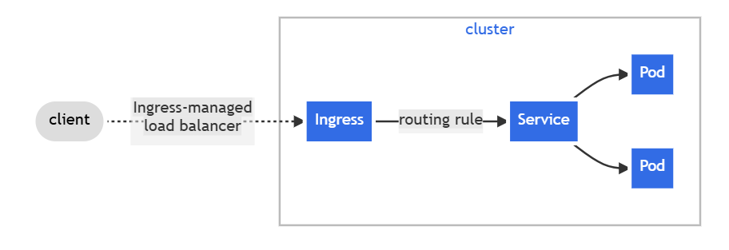

# Ingress

Ingress exposes HTTP and HTTPS routes from outside the cluster to services within the cluster. Traffic routing is controlled by rules defined on the Ingress resource.

Why we are using ingress?
1. Let’s say we use loadbalancer then there would be lots of services to which we need lots of ALB(which is costly things)
2. Let’s say we are not using cloud based k8s cluster which doesnt have load balancer facility then what would we do.
thats why we use ingress

There are 2 things:

1. First we need to install the ingress controller to use this functionality. There are multiple ingress controllers available like F5. nginx etc.
2. Then we need to create rules or specification of ingress to work so that;s why we create ingress resource. In ingress resource we specify which ingress controller to use(by ingress class name) and where to divert traffic, filtering and sending traffic to svcs.

Service have capablility also to load balance it but it follows round robin approach but in ingress(which can be called a load balancer) have many other capabilites.

In ingress resource spec ingress class need to be specified: **ingressClassName**: nginx-example
because there could be multiple ingress controller in the k8s cluster. if multiple controllers are there then this would create a race condition which leds to many problems. so it is better to specify class name.

