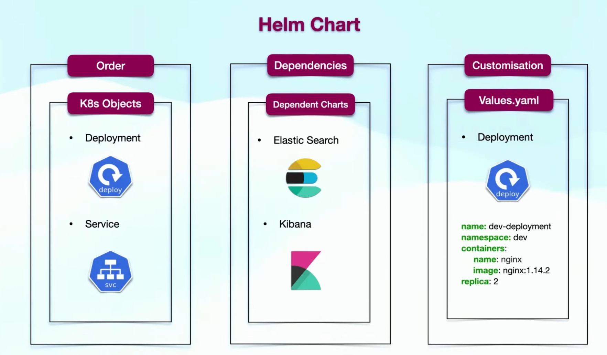

# Helm

kubectl create deploy my-deployment --image=nginx --dry-run=client -o yaml > templates/deployment.yml
kubectl create service nodeport my-service --tcp=80:80 --dry-run=client -o yaml > templates/service.yml
helm install first-release .
helm uninstall release-name
helm lint .
helm template .
helm pull --untar bitnami/wordpress --version 22.4
helm upgrade wordpress --values custom-values.yml
helm history my-wordpress
helm rollback my-wordpress 1

value schema:
It checks if the values provided by the user are correct. For example, it can ensure that:

A number is actually a number.
A required field isn’t left empty.
e.g:
values.yml:
replicaCount: 3
image:
repository: myapp
tag: latest

and values.schema.json:
{
"$schema": "[http://json-schema.org/draft-07/schema#](http://json-schema.org/draft-07/schema#)",
"type": "object",
"properties": {
"replicaCount": {
"type": "integer",
"minimum": 1
},
"image": {
"type": "object",
"properties": {
"repository": {
"type": "string"
},
"tag": {
"type": "string"
}
},
"required": ["repository", "tag"]
}
},
"required": ["replicaCount", "image"]
}