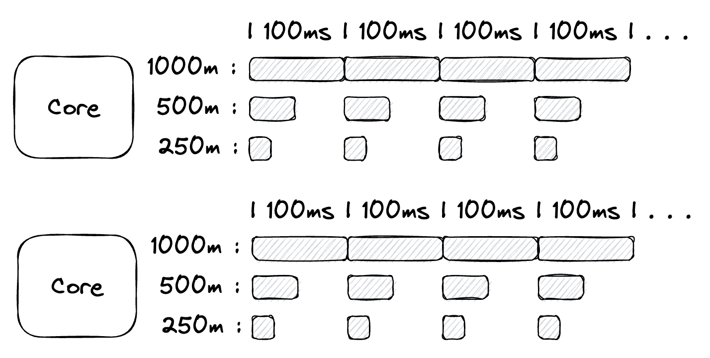

# CPU Limits

- A **CPU** in Kubernetes represents the processing power of your computer (or node in a cluster). Think of it as a worker that performs tasks.
- Kubernetes uses **millicores** to measure CPU:
    - **1000m (1000 millicores)** = 100% of one CPU (or 1 full core).
    - **250m** = 25% of one CPU.

Imagine you have a single CPU, which works like a rotating machine that handles jobs in cycles of **100 milliseconds (ms)**.

### Example 1: One service

If only one service runs on this CPU:

- You give it **1000m**.
- The service uses **all 100ms** of each cycle.

### Example 2: Two services

If you have two services and assign each **500m**:

- Each service gets **50ms** in a 100ms cycle.
- This means the CPU splits its time equally between the two services.

### Example 3: Four services

With four services, each assigned **250m**:

- Each service gets **25ms** in every 100ms cycle.
- The CPU divides its time among all the services.

### What if the node has two CPUs?

If the node has **two CPUs**, there is **200ms** available per cycle (100ms from each CPU):

- You can assign up to **2000m** of CPU time in total.
- Example:
    - Service 1: 1250m → 125ms
    - Service 2: 250m → 25ms
    - Service 3: 250m → 25ms
    - Service 4: 250m → 25ms




What is ms?
When Kubernetes allocates CPU to a service, it doesn’t give the service an entire CPU all at once. Instead, the CPU works in **time slices** (tiny chunks of time). These slices are measured in **milliseconds (ms)**.

Milliseconds are just a way to **split and share CPU time** among services:

1. If a service has a limit of **250m**, it gets **25ms of CPU time** in every 100ms cycle.
2. If a service has a limit of **500m**, it gets **50ms of CPU time** in every 100ms cycle.
- A service can only use the time it's allocated (e.g., 25ms if its limit is 250m).
- If it needs more, it has to wait for the next cycle to get more CPU time.

How **multi-threaded services** behave on multi-CPU nodes?

An **OS thread** is like a mini worker inside your service.

- A single-threaded service runs with **one OS thread**, doing one task at a time.
- A multi-threaded service runs with **many OS threads**, allowing it to do multiple tasks simultaneously.

Multi Threaded Example: Consider a simple web server that handles multiple client requests at the same time. A multi-threaded approach allows the server to handle each incoming client request in its own thread, enabling it to serve multiple clients concurrently. The main thread continues listening for new requests while the worker threads handle the existing ones.

Single Threaded Example: Many **IoT (Internet of Things) devices** and **embedded systems** still rely on single-threaded programming for efficiency. These devices are resource-constrained, with limited CPU and memory. 

Many **command-line utilities** or **scripts** are still single-threaded, especially when their purpose is simple data manipulation or processing. For example, **text processing tools** like `grep`, `sed`, `awk` (on Unix/Linux systems).
In some cases, **serverless computing platforms** like AWS Lambda, **Google Cloud Functions**, or **Azure Functions** run **single-threaded functions** (with a single invocation of the function handling the task).

Let’s say you have:

1. **Four CPUs** on a node.
2. A service with **four threads** (one thread per CPU).
3. A CPU limit of **1000m (1 full CPU)**.

### What Happens?

- The service's **four threads** can use up to 1000m total.
- Since 1000m equals **100ms of CPU time** per 100ms cycle:
    - Each thread gets **25ms** of CPU time in every cycle (100ms ÷ 4 threads).
    - The threads will be paused (context switching) once they hit this limit.

When a thread’s CPU time runs out, the operating system pauses it and switches to another thread or task. This adds overhead.

What happens when you not specify CPU limits?

If a pod has not specified any CPU requests, will it be able to run?

Creating a pod without CPU requests or limits will effectively allow it to be scheduled on any suitable node, regardless of the amount of CPU left on that node. In practice, it will still get some minimal CPU guarantees. However, it will not be able to use much CPU time when there is node pressure

CPU requests are used for scheduling, determining CPU time guarantees, and distributing CPU time proportionally.


CPU Limits:

CPU requests guarantee minimum CPU time and distribute CPU time proportionally. Meanwhile, CPU limits can throttle your application even when there are spare CPU cycles. So when would you want to set CPU limits?

Limits determine the maximum amount of resources that a container can use, preventing resource shortage or machine crashes due to excessive resource consumption. If it is set to `0`, it means no resource limit for the container. In particular, if you set `limits` without specifying `requests`, Kubernetes considers the value of `requests` is the same as that of `limits` by default.


**CPU VS Memory:**

### **CPU (Compressible Resource):**

- **Compressible**: This means CPU usage can be adjusted dynamically. A process can be throttled (slowed down) if it exceeds the allowed limit.
- **Shared**: Multiple Pods can share the same CPU when there is idle CPU capacity.
- **Elastic**: If no CPU limits are set and there’s unused capacity, Pods can use extra CPU resources temporarily.

### **Memory (Non-Compressible Resource):**

- **Non-compressible**: Memory cannot be "throttled." Once a Pod uses memory, it’s reserved for that Pod until it releases it.
- **Exclusive**: Memory is allocated to a Pod exclusively, and Pods cannot borrow or share memory from other Pods.
- **Fixed**: If a Pod requests more memory than is available on the node, the allocation fails, causing **OOMKill (Out of Memory Kill)**.

Completely Fair Scheduler (CFS):
The **Completely Fair Scheduler (CFS)** is the default CPU scheduler in Linux (since version 2.6.23). Its primary goal is to allocate CPU time fairly among processes, ensuring that each process gets a fair share of CPU time based on its priority and resource requirements. 

Cgroups (Control Groups):

cgroups are a kernel feature that allows you to partition and limit the system resources (CPU, memory, disk I/O, network, etc.) that a group of processes can use. Think of them as virtual cages where you can corral your processes and set rules for their behavior. This gives you fine-grained control over how your system’s resources are allocated, ensuring that critical processes get the resources they need while preventing others from hogging everything.
Cgroups work by organizing processes into hierarchical groups, called "cgroups," and then applying resource limits, monitoring, and control mechanisms at each level of the hierarchy.

- A **cgroup** is essentially a group of processes. You can create a hierarchy of cgroups (like a tree), with each node representing a group of processes.
- Each process belongs to one or more cgroups. You can assign processes to cgroups manually or automatically (e.g., when a service starts).
- These cgroups can be nested, meaning a parent cgroup can have child cgroups. Resources can be allocated differently to parent and child cgroups.

cgroup provides various controllers that manages specific resources. Some controllers are:

- **cpu**: Controls how much CPU time a cgroup can use. It can set limits or prioritize the CPU usage of processes in a cgroup.
- **memory**: Limits how much memory a cgroup can use. If a process in a cgroup exceeds this limit, it can be killed or otherwise handled.

You can set various resource limits for a cgroup using files inside the cgroup's control directory. For example, to limit the CPU usage of a cgroup:

- You would create a cgroup under the `/sys/fs/cgroup/cpu` directory (which is the mount point for the CPU controller).
- You can then specify the CPU time allocation for that group.

**Real World Example:**

A good example of cgroups in action is **Docker**. When you run containers using Docker, it uses cgroups to isolate and limit the resources each container can use.

For example, when you run a container with a command like:

```bash
bash
Copy code
docker run --memory=512m --cpus=1 my_container
```

Docker creates a cgroup for the container, assigns it the resource limits of 512 MB of memory and 1 CPU core, and ensures that no other processes on the host system can exceed these limits.

Systemd, the modern init system used by many Linux distributions, leverages cgroups extensively. It automatically places services and user sessions into different cgroups to manage their resource usage. This integration simplifies resource management and provides a more unified way to control and monitor processes.

- **CFS** is responsible for ensuring **fair CPU scheduling** by tracking processes' virtual runtimes and adjusting CPU allocation accordingly, giving each process a fair amount of time based on its priority.
- **Cgroups** allow you to **manage and limit resources** (such as CPU, memory, and I/O) for groups of processes, enabling you to allocate resources to different users or applications in a controlled and isolated manner.

### **What Happens When CPU is Overused?**

### **Scenario 1: Pod with CPU Limits**

- If a Pod’s service tries to use more CPU than its limit, Kubernetes throttles it.
- Throttling causes:
    - The service to run slower.
    - Requests to take longer to process.
    - Increased response time or delays.

### **Scenario 2: Pod Without CPU Limits**

- If there’s no limit set, the Pod can use idle CPU capacity on the node.
- However, if **all CPU resources are busy**, Kubernetes reduces the CPU share of the overusing Pod. This can lead to:
    - Reduced performance.
    - Delayed response times.
    - Starvation of resources for other Pods.

Memory management in Kubernetes works differently because memory is **non-compressible**. This means once a Pod uses memory, it cannot "give it back" until the Pod explicitly releases it.

### **What Happens When Memory is Overused?**

### **Scenario 1: Pod with Memory Limits**

- If a Pod exceeds its memory limit:
    - The process is terminated by the Linux kernel’s **OOM-killer**.
    - Kubernetes restarts the Pod automatically, but it will keep failing if the memory requirement remains unmet.

### **Scenario 2: Pod Without Memory Limits**

- If no limit is set and the node runs out of memory:
    - The node might crash or kill processes unpredictably.
    - Other Pods running on the same node could be affected.

**CPU is fundamentally different than memory. CPU is a compressible resource and memory is not. In simpler terms, you can give someone spare CPU in one moment when it's free, but that does not obligate you to continue giving them CPU in the next moment when another pod needs it. There is no downside to giving away idle CPU, because it's easy and non-violent to reclaim it.**

OOM Killed cases: https://home.robusta.dev/blog/kubernetes-memory-limit